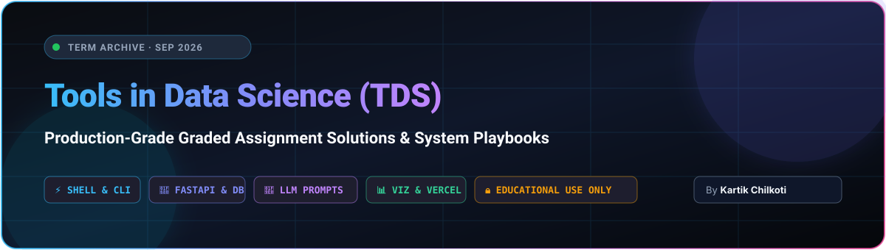
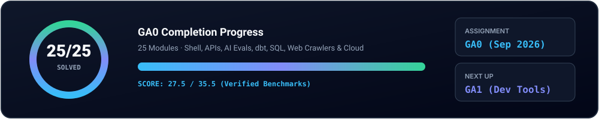

<div align="center">



<br/>

<a href="#-progress"></a>
<a href="https://github.com/chilkotiKartik/TDS-26-SEPT/actions"></a>

<a href="LICENSE"></a>


<br/><br/>

<a href="https://git.io/typing-svg"></a>

<br/>

**[Progress](#-progress)** &nbsp;·&nbsp;
**[Assignments](#-assignments)** &nbsp;·&nbsp;
**[GA0 Walkthrough](#-inside-ga0)** &nbsp;·&nbsp;
**[Toolbox](#-toolbox)** &nbsp;·&nbsp;
**[Add a New GA](#-adding-a-new-ga)** &nbsp;·&nbsp;
**[Playbook](#-playbook)** &nbsp;·&nbsp;
**[License](#-license--copyright)**

</div>


## 👋 What is this?

This is my personal working notebook and architectural reference for **Tools in Data Science (TDS)**, where every week brings a new tooling challenge: advanced shell scripting, resilient web scraping, FastAPI microservices, LLM prompt engineering, dbt analytics transformations, GitHub Actions CI/CD, and Vercel serverless deployments.

Every graded assignment receives **its own dedicated module folder**, and every question follows a systematic format:

> **Question** → **Answer** → **Steps to Reproduce** → **Gotchas & Edge Cases**

> ⚠️ **STRICTLY FOR LEARNING & PERSONAL REFERENCE ONLY:**
> This repository is published purely for educational exhibition and documentation of technical methods. Under no circumstances may any code, payloads, or answers be copied or submitted for academic credit. Most assignments are **dynamically personalised per user**, so understanding the underlying *methodology* is the key focus.


## 📈 Progress

<div align="center">
  
</div>

## 🗂️ Assignments

<!-- GA-TABLE:START -->
| Assignment | Topic | Score | Status | Folder |
|:--|:--|:--:|:--:|:--|
| **GA0** | Warm-up · Tools Tour & Benchmarks | **27.5** / 35.5 |  | [`tds-ga0-solutions/`](tds-ga0-solutions) |
| **GA1** | Development Tools | – |  | – |
| **GA2** | Deployment Tools | – |  | – |
| **GA3** | LLMs & AI Coding | – |  | – |
| **GA4** | Data Sourcing | – |  | – |
| **GA5** | Data Preparation | – |  | – |
| **GA6** | Data Analysis | – |  | – |
| **GA7** | Visualization | – |  | – |
| **P1** | Project 1 | – |  | – |
| **P2** | Project 2 | – |  | – |
<!-- GA-TABLE:END -->


## 🔎 Inside GA0

<table>
<tr>
<td width="33%" valign="top">

**🧮 Data & Shell**
- [Q4 · Sample variance](tds-ga0-solutions/q04-sample-variance)
- [Q7 · Crawl & count HTML](tds-ga0-solutions/q07-crawl-html)
- [Q16 · Move + rename files](tds-ga0-solutions/q16-move-rename-files)
- [Q19 · Replace across files](tds-ga0-solutions/q19-replace-across-files)
- [Q20 · Sort & filter JSON](tds-ga0-solutions/q20-sort-filter-json)
- [Q21 · SQL averages](tds-ga0-solutions/q21-sql-average-salary)
- [Q22 · Mixed encodings](tds-ga0-solutions/q22-unicode-encodings)

</td>
<td width="33%" valign="top">

**⚙️ APIs & Deploys**
- [Q5 · Code interpreter + AI](tds-ga0-solutions/q05-code-interpreter)
- [Q10 · FastAPI student API](tds-ga0-solutions/q10-fastapi-students)
- [Q11 · Batch sentiment API](tds-ga0-solutions/q11-fastapi-sentiment)
- [Q13 · GitHub Action](tds-ga0-solutions/q13-github-action)
- [Q18 · Ollama + ngrok](tds-ga0-solutions/q18-ollama-ngrok)
- [Q24 · Use GitHub](tds-ga0-solutions/q24-use-github)
- [Q25 · Vercel analytics](tds-ga0-solutions/q25-vercel-latency)

</td>
<td width="33%" valign="top">

**🧠 LLMs, Viz & Web**
- [Q1 · Fix a lying axis](tds-ga0-solutions/q01-axis-scale-repair)
- [Q2 · Binary eval rubric](tds-ga0-solutions/q02-binary-eval-rubric)
- [Q3 · Hypothesis bug hunt](tds-ga0-solutions/q03-bug-hunter-hypothesis)
- [Q6 · Colour encoding](tds-ga0-solutions/q06-color-encoding)
- [Q8 · CSS selectors](tds-ga0-solutions/q08-css-selectors)
- [Q9 · dbt mart](tds-ga0-solutions/q09-dbt-mart)
- [Q12 · Make an LLM say *Yes*](tds-ga0-solutions/q12-llm-say-yes)
- [Q14 · Jigsaw → grayscale](tds-ga0-solutions/q14-image-grayscale)
- [Q15 · httpx + LLM API](tds-ga0-solutions/q15-llm-sentiment-httpx)
- [Q17 · Graph detective](tds-ga0-solutions/q17-network-game)
- [Q23 · DevTools](tds-ga0-solutions/q23-devtools)

</td>
</tr>
</table>

<details>
<summary><b>⭐ Favourite GA0 Breakthroughs & Gotchas (click to expand)</b></summary>
<br/>

| Question | The Technique |
|:--|:--|
| **Q12 · Say "Yes"** | The prompt forbids affirmative answers. Structuring the query as a Title-Case **boolean evaluation matrix** returns `Yes` reliably across iterations without triggering explicit safety refusals. |
| **Q14 · Image Reconstruction** | Fingerprint protection injects ±1 sub-pixel noise into canvas rendering, corrupting checksum comparisons. Running on standard profiles resolves the verification mismatch. |
| **Q1 · Axis Scale Repair** | The automated checker inspects the **leading numeric comment** inside HTML source comments (`Distortion ratio: 1.0`). |
| **Q6 · Color Lightness** | Hex color definitions across CSS styling are tested for strict monotonic perceptual lightness scaling. |
| **Q13 · GitHub Actions** | URLs formatted with `.git` suffixes can prevent workflow runners from parsing runs; strip the extension. |

</details>


## 🧰 Toolbox & Stack

<div align="center">


<br/><br/>


</div>

## 🧭 Repository Architecture

```text
TDS-26-SEPT/
├── assets/                       # High-frame SVG banners, progress dials, dividers & footers
├── LICENSE                       # Strict Proprietary License & Anti-Copying Policy
├── README.md                     # Central repository documentation & roadmap
└── tds-ga0-solutions/             # Graded Assignment 0 Solutions (25 Modules)
    ├── LICENSE
    ├── README.md
    ├── email.json
    ├── .github/workflows/ci.yml
    ├── q01-axis-scale-repair/
    │   ├── README.md
    │   └── corrected_chart.html
    ├── …
    └── q25-vercel-latency/
        ├── api/index.py
        └── vercel.json
```


## ➕ Adding a New GA Module

Each week's assignment is added as a self-contained module:

```bash
# 1. Create the new assignment directory
mkdir tds-ga1-solutions

# 2. Add question directories, README notes, and reproducible code
#    tds-ga1-solutions/q01-.../README.md

# 3. Update the assignments roadmap table in README.md

# 4. Commit and push to main
git add .
git commit -m "Add GA1: solutions and engineering writeup"
git push origin main
```


## 💡 Engineering Playbook

<table>
<tr>
<td width="50%" valign="top">

**🔍 Inspect Checker Logic First**<br/>
Browser assessment frameworks evaluate JavaScript assertions directly. Inspecting evaluation scripts via DevTools clarifies exact parsing criteria, regex tolerances, and boundary cases.

**🖥️ Local Loopback Flexibility**<br/>
Client-side evaluations run within your local browser context, meaning `http://127.0.0.1:8000` endpoints function without remote tunneling unless explicit public hosts are specified.

**💾 Persist State Early**<br/>
Grading systems evaluate the most recent saved snapshot prior to deadlines. Ensure all solution hashes and endpoints are verified before finalizing.

</td>
<td width="50%" valign="top">

**🧪 Binary File Integrity**<br/>
For SHA-256 and checksum validations, avoid text editors that alter CRLF/LF line terminators. Execute transformations using standard Unix utilities (`sed`, `awk`, `LC_ALL=C sort`).

**🤖 Non-Deterministic LLM Testing**<br/>
Validate prompts across multiple iterations against target system prompts to ensure statistical consistency before freezing templates.

**🛡️ Browser Extension Isolation**<br/>
Disable script blockers and canvas anti-fingerprinting shields on assessment environments to avoid synthetic DOM perturbations during canvas inspections.

</td>
</tr>
</table>


## 🔒 License & Copyright

**Copyright © 2026 Kartik Chilkoti. All Rights Reserved.**

This repository and all associated materials (source code, documentation, architectures, solutions) are the exclusive proprietary property of **Kartik Chilkoti**.

- **STRICTLY FOR LEARNING PURPOSES:** Published solely for personal portfolio demonstration and reference.
- **NO COPYING:** Reproduction, distribution, mirroring, public hosting, or academic submission without prior written authorization is strictly prohibited.
- For complete terms and legal provisions, refer to [LICENSE](LICENSE).

<div align="center">


<sub>⭐ Created and maintained by <b>Kartik Chilkoti</b></sub>
</div>
